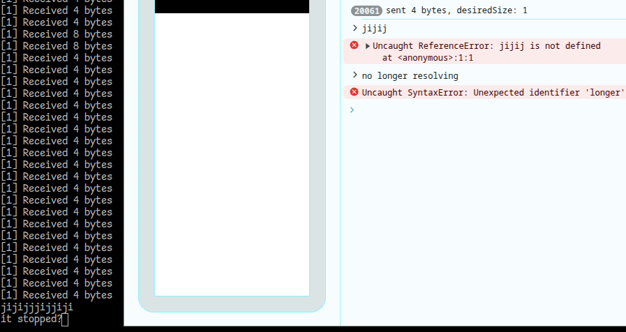

# Instructions

1. `bun install`
2. (while still in the root directory of the repo)

```
openssl req -x509 -newkey ec -pkeyopt ec_paramgen_curve:prime256v1 \
-nodes -keyout key.pem -out cert.pem -days 13 \
-subj "/CN=127.0.0.1" \
-addext "subjectAltName=IP:127.0.0.1"

#https://stackoverflow.com/a/76125650
```

3. `bun start`
4. The server will console log a line of code that looks like this:

```
const transport = new WebTransport(...);
```

It must be pasted into `client.html`, replacing the original `const transport = new WebTransport()`. Otherwise you see a certificate error like this in browser:

```
Failed to establish a connection to https://127.0.0.1:8642/: net::ERR_QUIC_PROTOCOL_ERROR.QUIC_TLS_CERTIFICATE_UNKNOWN (TLS handshake failure (ENCRYPTION_HANDSHAKE) 46: certificate unknown. SSLErrorStack:[handshake.cc:298] error:1000007d:SSL routines:OPENSSL_internal:CERTIFICATE_VERIFY_FAILED).Understand this error
(index):1 Uncaught WebTransportError: Opening handshake failed.
```

5. In browser, connect to USB remote debugging on the Android device. The URL you visit must be an IPv4 address like `https://192.168.x.x:8080` - eg. I couldn't get `localhost` to work. Make sure it's HTTPS in order to make WebTransport API available
6. Accept the "your connection is not private" warning
7. Watch both the server terminal and the DevTools console. You should see dummy data transfer for a little while before it halts indefinitely. There are typically many more "sent" logs than "received" logs, however, they both eventually stop logging.
   
8. Because the repro case is so minimal, the server must be killed and restarted in order to repeat the test.
